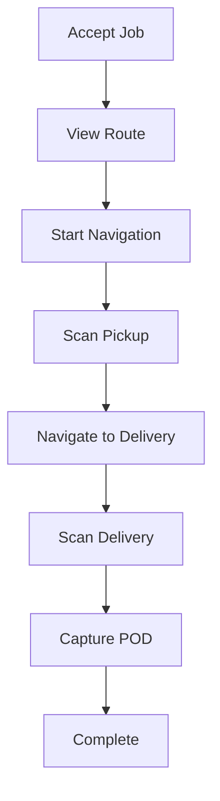
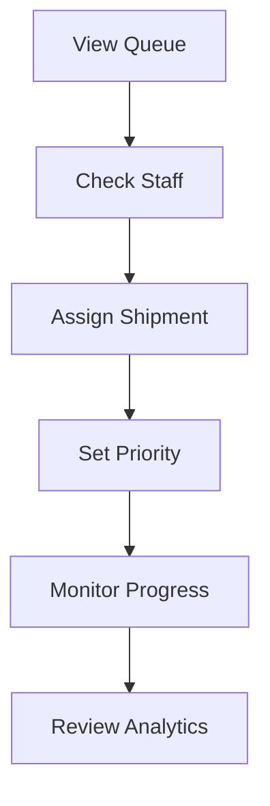

# Delivery Logistics - Quick Reference

## 🚀 Quick Start

### 1. Install Dependencies
```yaml
# pubspec.yaml
dependencies:
  mobile_scanner: ^5.0.0
```

### 2. Run Migrations
```bash
psql $DATABASE_URL -f migrations/split/28_delivery_logistics_extensions.sql
psql $DATABASE_URL -f migrations/split/policies/28_delivery_logistics_policies.sql
```

### 3. Create Storage Buckets
- `delivery_photos`
- `signatures`

## 📦 Core Components

### DeliveryService
```dart
final service = DeliveryService(Supabase.instance.client);
```

## 🔧 Common Tasks

### Create Route
```dart
final route = await service.createRoute(
  shipmentId: shipmentId,
  staffId: staffId,
  waypoints: waypoints,
);
```

### Scan Barcode
```dart
// UI approach
final scan = await Navigator.push(
  context,
  MaterialPageRoute(
    builder: (context) => BarcodeScannerScreen(
      shipmentId: shipmentId,
      staffId: staffId,
      scanType: 'pickup',
      service: service,
    ),
  ),
);

// Direct approach
final scan = await service.recordBarcodeScan(
  shipmentId: shipmentId,
  staffId: staffId,
  barcodeValue: 'PKG123',
  scanType: 'delivery',
);
```

### Capture Proof of Delivery
```dart
final pod = await Navigator.push(
  context,
  MaterialPageRoute(
    builder: (context) => ProofOfDeliveryScreen(
      shipmentId: shipmentId,
      staffId: staffId,
      service: service,
    ),
  ),
);
```

### Dispatch Assignment (Admin)
```dart
await service.createDispatchAssignment(
  shipmentId: shipmentId,
  staffId: staffId,
  assignedBy: adminUserId,
  priority: 1, // 1-5, 1 = highest
);
```

### View Analytics
```dart
Navigator.push(
  context,
  MaterialPageRoute(
    builder: (context) => ProviderAnalyticsDashboard(
      providerId: providerId,
    ),
  ),
);
```

## 📊 Key Models

### DeliveryRoute
```dart
DeliveryRoute(
  id, shipmentId, staffId,
  waypoints, optimizedOrder,
  totalDistanceMeters, estimatedDurationMinutes,
  status, startedAt, completedAt,
)
```

### BarcodeScan
```dart
BarcodeScan(
  id, shipmentId, staffId,
  barcodeValue, scanType,
  scannedAt, latitude, longitude,
)
```

### ProofOfDelivery
```dart
ProofOfDelivery(
  id, shipmentId, staffId,
  deliveredAt, recipientName,
  recipientSignatureUrl, photoUrls,
  latitude, longitude, notes, deliveryCondition,
)
```

## 🔐 Permissions

| Table | Staff | Provider | Order Owner | Admin |
|-------|-------|----------|-------------|-------|
| delivery_routes | Read/Update Own | Full Access | - | Full |
| barcode_scans | Insert/Read Own | Read All | - | Full |
| proof_of_delivery | Full Own | Read All | Read Own | Full |
| dispatch_assignments | Read/Update Own | - | - | Full |

## 🎯 Scan Types

- `pickup` - Package picked up from vendor/warehouse
- `delivery` - Package delivered to customer
- `return` - Package returned

## 📍 Delivery Conditions

- `good` - Package in good condition
- `damaged` - Package damaged
- `partial` - Partial delivery

## 🚦 Shipment Status Flow

```
pending → assigned → in_transit → delivered
              ↓
         issue_reported
```

## 🏃 Driver Workflow



## 🎛️ Admin Workflow



## 🧪 Test Checklist

- [ ] Create route with 3+ waypoints
- [ ] Scan barcode at pickup
- [ ] Scan barcode at delivery
- [ ] Take 2+ delivery photos
- [ ] Submit POD with recipient name
- [ ] Admin assign shipment
- [ ] View provider analytics
- [ ] Check staff performance

## 🐛 Troubleshooting

### Camera not working?
- Check permissions in app settings
- Verify `mobile_scanner` installed
- Test on physical device

### Upload fails?
- Verify storage buckets exist
- Check storage policies
- Ensure file size < 5MB

### Analytics empty?
- Verify date range
- Check provider has deliveries
- Ensure shipments have timestamps

## 📚 Documentation

- Full Guide: `DELIVERY_LOGISTICS_GUIDE.md`
- Summary: `DELIVERY_LOGISTICS_SUMMARY.md`
- Code: `lib/app/delivery/`

## 🔗 Key Files

| File | Purpose |
|------|---------|
| `delivery_models.dart` | Data models |
| `delivery_service.dart` | Business logic |
| `barcode_scanner_screen.dart` | Barcode UI |
| `proof_of_delivery_screen.dart` | POD capture UI |
| `dispatch_management_screen.dart` | Admin dispatch |
| `provider_analytics_dashboard.dart` | Analytics UI |
