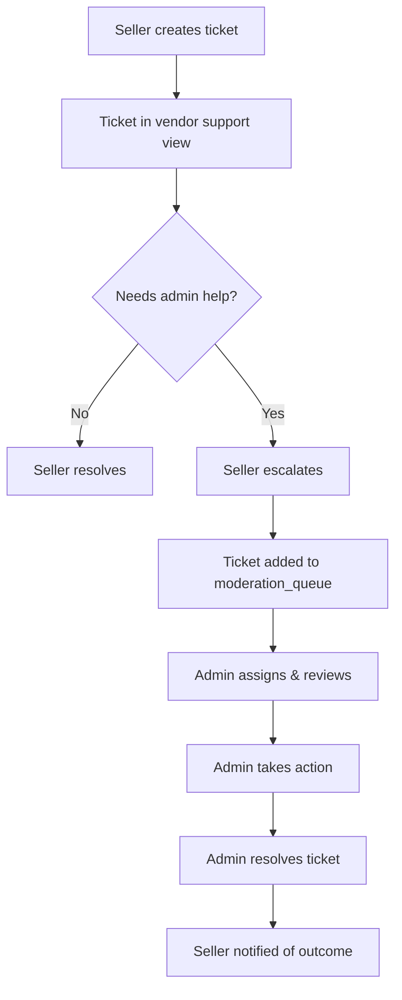
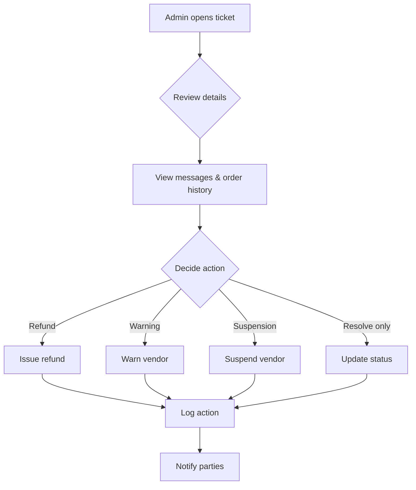

# Support Moderation System Guide

## Overview

The JoMarket Support Moderation System provides platform administrators with comprehensive tools to manage customer support tickets, enforce vendor policies, and maintain service quality through efficient ticket resolution and escalation workflows.

## Architecture

### Database Schema

#### Core Tables

1. **moderation_queue**
   - Tracks tickets requiring admin attention
   - Manages assignment, priority, severity, and SLA deadlines
   - Stores internal admin notes
   - Fields: `id`, `ticket_id`, `assigned_admin_id`, `status`, `priority`, `severity`, `escalated_at`, `tags`, `sla_deadline`, `notes`, `created_at`, `updated_at`

2. **moderation_actions**
   - Immutable audit trail of all admin actions
   - Records enforcement actions (refunds, warnings, suspensions)
   - Fields: `id`, `ticket_id`, `admin_id`, `action`, `target_entity_type`, `target_entity_id`, `details`, `notes`, `created_at`

3. **vendor_enforcement_actions**
   - Tracks vendor warnings, suspensions, and bans
   - Supports temporary restrictions with expiry dates
   - Fields: `id`, `vendor_id`, `ticket_id`, `admin_id`, `action_type`, `reason`, `details`, `active`, `expires_at`, `created_at`

4. **support_tickets** (Enhanced)
   - New fields: `escalated`, `escalation_reason`, `escalated_at`, `severity`, `tags`, `sla_status`, `first_response_at`, `resolved_at`

### SLA Management

**Priority and Severity Levels:**
- **Critical**: 2-hour response time
- **High**: 4-8 hours (depending on severity)
- **Medium**: 24 hours
- **Low**: 48 hours

**SLA States:**
- `on_track`: Within normal time window
- `at_risk`: Within 25% of deadline
- `breached`: Past deadline

**Automatic Monitoring:**
```sql
-- Function to update SLA statuses
CREATE OR REPLACE FUNCTION update_sla_status()
RETURNS void AS $$
BEGIN
  UPDATE public.moderation_queue
  SET sla_status = 'at_risk'
  WHERE status NOT IN ('resolved', 'closed')
    AND sla_status = 'on_track'
    AND now() >= (sla_deadline - (sla_deadline - created_at) * 0.25);
  
  UPDATE public.moderation_queue
  SET sla_status = 'breached'
  WHERE status NOT IN ('resolved', 'closed')
    AND now() >= sla_deadline;
END;
$$ LANGUAGE plpgsql;
```

### Row-Level Security (RLS)

All moderation tables enforce strict RLS policies:

- **Admin-Only Access**: Only platform admins (verified via `is_platform_admin()`) can view and modify moderation queue and actions
- **Vendor Read Access**: Vendors can view enforcement actions against them
- **Audit Trail Protection**: `moderation_actions` table is insert-only (no updates/deletes)

## Application Layer

### Repository (moderation_repository.dart)

**Key Methods:**

```dart
// Queue management
Future<List<ModerationQueueItem>> getModerationQueue({...filters})
Future<void> assignTicket(String queueId, String adminId)
Future<void> updateQueueStatus(String queueId, String newStatus, String adminId)

// Ticket operations
Future<TicketWithMessages?> getTicketWithMessages(String ticketId)
Future<void> updateTicketStatus(String ticketId, String newStatus, String adminId)
Future<void> addTicketReply(String ticketId, String adminId, String body)
Future<void> addInternalNote(String queueId, String adminId, String note)

// Enforcement actions
Future<void> issueRefund({required String ticketId, required String adminId, ...})
Future<void> issueVendorWarning({required String ticketId, required String adminId, ...})
Future<void> suspendVendor({required String ticketId, required String adminId, ...})

// Analytics
Future<ModerationStats> getModerationStats()
Future<List<ModerationAction>> getTicketActions(String ticketId)
```

### UI Components

#### 1. Moderation Dashboard (moderation_dashboard.dart)

**Features:**
- Tabbed interface with filters (All, New, Open, SLA Risk, Resolved)
- Real-time statistics cards (avg response time, resolution time, escalations, breaches)
- Queue item cards showing priority, severity, SLA status, tags, and metadata
- Filter modal for priority, severity, and assignment status

**Tabs:**
- **All**: Complete queue view
- **New**: Unassigned tickets requiring immediate attention
- **Open**: Tickets assigned and being worked on
- **SLA Risk**: Tickets at risk or breached
- **Resolved**: Completed tickets

#### 2. Ticket Detail Workspace (ticket_detail_dialog.dart)

**Features:**
- Full-screen modal dialog with three tabs:
  - **Details**: Ticket metadata, priority, severity, SLA countdown, related entities (vendor, order), internal notes
  - **Messages**: Conversation thread with customer/vendor, reply interface
  - **Actions**: Enforcement action buttons (refund, warning, suspension), action history

**Actions:**
- Assign to admin
- Change status (open → in_progress → resolved → closed)
- Add internal notes (admin-only)
- Add public replies (visible to ticket owner)
- Trigger enforcement actions

## Workflows

### 1. Ticket Escalation Flow (Seller → Admin)



**Implementation:**
```dart
// In seller support module
await sellerRepository.escalateTicketToAdmin(
  ticketId,
  'Customer claims product defect, requesting refund verification'
);

// Creates entry in moderation_queue automatically
await moderationRepository.createModerationQueueEntry(
  ticketId: ticketId,
  priority: 'high',
  severity: 'medium',
  tags: ['refund_request', 'product_quality'],
);
```

### 2. Admin Resolution Flow



### 3. SLA Monitoring (Background Job)

**Setup:**
1. Create Supabase Edge Function or scheduled job (cron)
2. Call `update_sla_status()` every 15 minutes
3. Trigger notifications for at-risk tickets

**Example Edge Function:**
```typescript
import { serve } from "https://deno.land/std@0.168.0/http/server.ts"
import { createClient } from 'https://esm.sh/@supabase/supabase-js@2'

serve(async (req) => {
  const supabase = createClient(
    Deno.env.get('SUPABASE_URL') ?? '',
    Deno.env.get('SUPABASE_SERVICE_ROLE_KEY') ?? ''
  )

  // Update SLA statuses
  await supabase.rpc('update_sla_status')

  // Fetch at-risk tickets
  const { data } = await supabase
    .from('moderation_queue')
    .select('id, ticket_id, assigned_admin_id')
    .eq('sla_status', 'at_risk')

  // Send notifications to assigned admins
  // (Implement notification logic here)

  return new Response(JSON.stringify({ updated: data?.length }))
})
```

## Integration with Existing Systems

### Seller Module Integration

**Update `seller_repository.dart`:**
```dart
// Already implemented:
Future<void> escalateTicketToAdmin(String ticketId, String reason) async {
  await _client.from('support_tickets').update({
    'escalated': true,
    'escalation_reason': reason,
    'escalated_at': DateTime.now().toUtc().toIso8601String(),
  }).eq('id', ticketId);
}
```

**In Seller Support UI:**
- Add "Escalate to Admin" button on ticket detail screens
- Show escalation status and admin responses
- Display moderation results (refund issued, warning applied, etc.)

### Navigation & Routing

**Admin Dashboard Entry Point:**
```dart
// In admin_analytics_screen.dart
ListTile(
  leading: const Icon(Icons.flag_outlined),
  title: const Text('Moderation Queue'),
  subtitle: const Text('Review flagged content'),
  onTap: () {
    Navigator.of(context).push(
      MaterialPageRoute(builder: (_) => const ModerationDashboardScreen()),
    );
  },
)
```

## Testing

### Unit Tests

```dart
void main() {
  late ModerationRepository repository;
  late SupabaseClient mockClient;

  setUp(() {
    mockClient = MockSupabaseClient();
    repository = ModerationRepository(mockClient);
  });

  test('getModerationQueue filters by status', () async {
    // Arrange
    when(mockClient.from('moderation_queue').select(any))
      .thenReturn(mockQuery);
    
    // Act
    await repository.getModerationQueue(status: 'new');
    
    // Assert
    verify(mockQuery.eq('status', 'new')).called(1);
  });

  test('assignTicket creates action log', () async {
    // Arrange & Act
    await repository.assignTicket('queue-id', 'admin-id');
    
    // Assert
    verify(mockClient.from('moderation_actions').insert(any)).called(1);
  });
}
```

### Integration Tests

```dart
testWidgets('Moderation dashboard loads queue items', (tester) async {
  await tester.pumpWidget(
    MaterialApp(home: ModerationDashboardScreen()),
  );
  await tester.pumpAndSettle();

  expect(find.text('Moderation Queue'), findsOneWidget);
  expect(find.byType(TabBar), findsOneWidget);
  expect(find.text('All'), findsOneWidget);
});
```

## Permissions & Security

### Admin Role Verification

Ensure users have the `platform_admin` role:

```sql
-- Check in platform_admins table
SELECT user_id FROM public.platform_admins WHERE user_id = auth.uid();
```

### API Access Control

All moderation endpoints automatically enforce RLS policies. Attempting to access moderation data without admin privileges will result in empty results (no errors thrown).

## Monitoring & Analytics

### Key Metrics

Track in `ModerationStats`:
- **Average Response Time**: Time from ticket creation to first admin response
- **Average Resolution Time**: Time from creation to resolution
- **SLA Breach Rate**: Percentage of tickets breaching deadlines
- **Escalation Volume**: Number of tickets escalated by vendors
- **Action Distribution**: Breakdown of enforcement actions (refunds, warnings, suspensions)

### Dashboard Widgets

```dart
_StatCard(
  title: 'Avg Response',
  value: '${stats.averageResponseTimeMinutes.toInt()} min',
  icon: Icons.timer,
  color: Colors.blue,
)
```

## Future Enhancements

### Phase 2 Features

1. **Auto-Assignment Rules**
   - Round-robin assignment to available admins
   - Workload balancing based on active tickets
   - Specialized queues (refunds, disputes, quality issues)

2. **Advanced Filtering & Search**
   - Full-text search across ticket content
   - Date range filters
   - Multi-tag selection
   - Saved filter presets

3. **Bulk Actions**
   - Assign multiple tickets at once
   - Bulk status updates
   - Export to CSV/PDF

4. **Template Responses**
   - Pre-defined reply templates for common scenarios
   - Macro shortcuts for enforcement actions
   - Personalization variables (customer name, order number, etc.)

5. **Real-Time Notifications**
   - Push notifications for new escalations
   - Desktop alerts for SLA breaches
   - Email digests for daily/weekly summaries

6. **Analytics Dashboards**
   - Time-series charts (tickets over time, resolution trends)
   - Comparative reports (this week vs last week)
   - Admin performance metrics
   - Vendor quality scorecards

7. **Dispute Resolution Workflow**
   - Evidence collection (photos, POD data)
   - Mediation tools
   - Automatic refund calculations based on order value

## Troubleshooting

### Common Issues

**Issue**: Moderation queue is empty despite escalated tickets
- **Cause**: Tickets not added to `moderation_queue` table
- **Fix**: Ensure `createModerationQueueEntry` is called after escalation

**Issue**: Admin cannot see certain tickets
- **Cause**: RLS policy blocking access
- **Fix**: Verify admin is in `platform_admins` table

**Issue**: SLA statuses not updating
- **Cause**: Background job not running or `update_sla_status()` not being called
- **Fix**: Set up scheduled Edge Function or manual cron job

**Issue**: Actions not appearing in audit log
- **Cause**: `logModerationAction` not being called after operations
- **Fix**: Add audit logging to all repository methods that modify tickets

## Migration Steps

### Applying the Schema

1. Run the main migration:
   ```bash
   psql -h <host> -U postgres -d <database> -f migrations/split/35_moderation_system.sql
   ```

2. Apply RLS policies:
   ```bash
   psql -h <host> -U postgres -d <database> -f migrations/split/policies/35_moderation_policies.sql
   ```

3. Verify tables were created:
   ```sql
   \dt public.moderation*
   \dt public.vendor_enforcement*
   ```

4. Test RLS policies:
   ```sql
   SET LOCAL ROLE authenticated;
   SELECT * FROM public.moderation_queue; -- Should return empty for non-admins
   ```

### Data Migration (if existing tickets need to be moved)

```sql
-- Migrate existing escalated tickets to moderation queue
INSERT INTO public.moderation_queue (ticket_id, status, priority, severity, escalated_at)
SELECT 
  id, 
  'new', 
  COALESCE(priority, 'medium'), 
  'medium',
  escalated_at
FROM public.support_tickets
WHERE escalated = true
  AND status NOT IN ('resolved', 'closed')
  AND NOT EXISTS (
    SELECT 1 FROM public.moderation_queue mq WHERE mq.ticket_id = support_tickets.id
  );
```

## Support & Maintenance

- **Code Location**: `lib/app/admin/moderation/`
- **Migration Files**: `migrations/split/35_moderation_system.sql`, `migrations/split/policies/35_moderation_policies.sql`
- **Documentation**: This file (`SUPPORT_MODERATION_GUIDE.md`)
- **Related Docs**: `SELLER_WORKSPACE_IMPLEMENTATION.md`, `INTEGRATION_CHECKLIST.md`

For questions or issues, refer to the repository's issue tracker or contact the development team.
