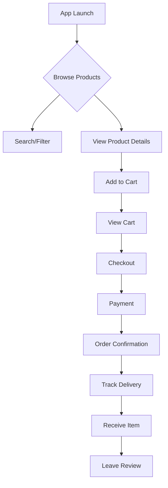
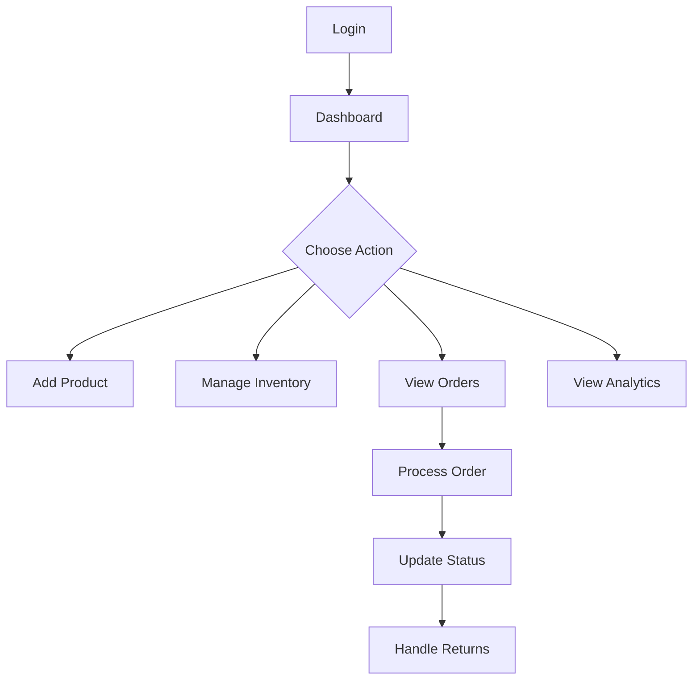
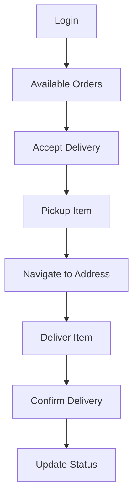

# JoMarket Multivendor E-commerce App Design Plan

> Changelog (2025-11-04): Added "Introduction & Solo Development Approach" and "MVP vs Long-Term Feature Scope" sections from the updated design PDF; editorial rewrite for clarity and brevity (2025-11-04).
> Changelog (2025-11-04): Added "Introduction & Solo Development Approach" and "MVP vs Long-Term Feature Scope" sections from the updated design PDF; editorial rewrite for clarity and brevity (2025-11-04).
> Changelog (2025-11-04 - editorial): Full-document editorial pass for tone, length, and heading consistency. Minor clarifications and tightened paragraphs across architecture, scalability, security and roadmap sections.

## Introduction & Solo Development Approach

JoMarket is a mobile-first multivendor marketplace targeting Jordan. This document captures the core architecture, MVP scope, and a phased roadmap designed for a solo developer supported by AI tooling. The immediate goal is a lean, reliable MVP that focuses on buyer flows and essential seller tools; more advanced features follow in later phases.

To stay efficient, development is iterative: prioritize features that deliver user value and enable meaningful feedback (search, product browsing, single-vendor checkout, basic seller operations). AI assistants will be used to accelerate routine work (boilerplate, tests, suggestions), while manual review, testing, and CI gates protect quality.

Localization and regional fit are core requirements: bilingual (Arabic/English) UI with RTL support, Jordanian Dinar (JOD) pricing, and local payment options including Cash on Delivery (COD). Address capture and mapping will be adapted for regional norms (accept flexible address formats and optionally use map pins).

## MVP vs Long-Term Feature Scope

### MVP (Initial Release)

- Buyer: Browse/search products, view details, add items from a single vendor to a cart, and complete a single-vendor checkout (online card or COD). Buyers receive order status updates and notifications.
- Seller: Register, list/edit products (title, description, price, stock, images), view orders, and update order status. A compact sales summary is included.
- Platform: Role-based access, Supabase-backed database and auth, modular Flutter codebase (ready to add deliverer and web modules), and full Arabic/English localization.

### Long-Term Goals (phased)

- Multi-vendor cart and backend order splitting with per-vendor shipments and distributed payouts.
- Full-featured seller web dashboard: bulk imports, variant editor, richer analytics, and customer support tools.
- Deliverer & logistics: courier workflows, GPS tracking, route optimization, proofs-of-delivery, and an optional standalone courier app.
- Payments & payouts: marketplace payment integration (Stripe Connect or regional equivalent), automated payouts, dispute handling, and fraud detection.
- Enhanced UX: AR previews, personalization, live seller tools (chat/streaming), and AI-driven recommendations and analytics.

This focused MVP approach keeps the launch achievable while preserving expansion paths for growth and scale.

## 1. Overall App Architecture

### App structure
JoMarket starts as a single, modular Flutter app (iOS/Android) with role-based UI for buyers, sellers and — later — deliverers. The codebase is split into feature modules (core, buyer, seller-lite, deliverer) that share services and design tokens; modules load only when required to keep the runtime lightweight.

- Frontend: Flutter mobile app with deferred module loading and a shared design system.
- Seller companion (future): Responsive web dashboard (Flutter Web or React) for catalog management and analytics.
- Deliverer strategy: Deliverer flows are isolated inside a module and can be extracted into a lightweight courier build later.
- Backend: Supabase (Postgres, Auth, Storage, Edge Functions) as the primary backend; optional external workers for heavy jobs.
- Architecture: MVVM with a repository layer and Provider/Riverpod for state management; ViewModels remain small and testable.

### Core Components
- **Authentication Module**: Role-based login with Supabase Auth, multi-factor support, and contextual onboarding (buyer, seller, deliverer).
- **Product Catalog**: Searchable, filterable listings with caching, variant support, and offline-ready catalogue snapshot.
- **Vendor Management**: Seller-lite mobile features (alerts, messaging) plus full web dashboard for catalog operations, bulk inventory updates, and support tooling.
- **Order Management**: End-to-end processing with split vendor orders, partial fulfillment, and background jobs for reminders, settlement, refunds, and return handling.
- **Payment Integration**: Stripe Connect marketplace flows, 3DS support, dispute callbacks, and payout scheduling.
- **Delivery Tracking**: Real-time order status updates, deliverer assignment, GPS logging with privacy controls, and optional standalone courier build target.

### Data Models
- `users` (buyer/seller/deliverer/admin profiles, role metadata, consent flags)
- `vendors` (business verification, payout configuration, legal documents)
- `products` (variants, categories, media, attributes, archival flags)
- `inventory` (stock levels, allocation per warehouse/vendor)
- `orders` (multi-vendor splits, fulfillment states, audit trail)
- `order_items` (item-level fulfillment, returns, adjustments)
- `fulfillments` (shipment legs, courier assignments, timestamps)
- `shipping_addresses` (normalized addresses, validation status)
- `carts` and `wishlist` (per-user saved selections)
- `transactions` (Stripe payment intents, payouts, fees, dispute references)
- `payouts` (vendor settlement records, tax reporting data)
- `reviews` (product, vendor, deliverer feedback with moderation flags)
- `notifications` (in-app, push, email history)
- `support_tickets` (buyer/vendor support threads, escalation paths)
- `activity_logs` (immutable audit events for compliance)

Row Level Security (RLS) will be enforced per table with policies scoped by role, ownership, and order/vendor relationships. Soft deletes and archival timestamps prevent accidental data loss while preserving history. Event sourcing (via append-only tables and Supabase Functions) tracks order/payment lifecycle changes for reconciliation.

### Backend integration
- Supabase Auth for authentication and role claims, with optional links to payment providers.
- Postgres (via Supabase) as the primary datastore with real-time subscriptions and optional read replicas.
- Supabase Storage for media (CDN-backed) and optional automatic resizing pipelines.
- Edge Functions and scheduled jobs for webhooks, settlements, notifications and scheduled tasks.
- Worker queues for retryable or long-running processes (webhook retries, KYC, bulk imports).

## 2. Key Features

### For Buyers
- Browse and search products
- Compare items side-by-side
- Add to cart and wishlist
- Secure checkout with multiple payment options
- Order tracking and delivery updates
- Review and rate purchases
- Customer support chat

### For Sellers
- Vendor dashboard with analytics
- Product listing and management
- Inventory control
- Order fulfillment tracking
- Sales reports and insights
- Earnings and payout management
- Communication with buyers

### For Deliverers
- Delivery assignment notifications
- Route optimization
- Real-time order status updates
- Earnings tracking
- Performance metrics
- GPS tracking for pickup/delivery

## 3. User Interface Wireframes

### Home Page (Buyer)
- Hero banner with featured products and seasonal promotions
- Category grid with quick access chips (price drop, local artisans)
- Trending/popular items carousel with skeleton loaders for pending state
- Search bar with voice input and saved recent searches
- Global filter drawer and bottom navigation (`Home`, `Discover`, `Cart`, `Messages`, `Profile`)
- Accessibility toggles (font scaling, high contrast) surfaced in profile menu

### Product Listings
- Sticky filter header (category, price, rating, vendor, fulfillment type) and quick-sort pills
- Grid/list toggle, infinite scroll with graceful empty/error states
- Product cards showing badges (free shipping, best seller), variant thumbnails, and vendor rating snapshot
- Persistent compare tray to juxtapose selected products

### Product Detail Page
- Image gallery with pinch-zoom, AR preview hook, and fallback placeholders
- Pricing block with variant selector, stock indicator, and delivery ETA calculator
- Vendor badge linking to profile, trust markers, and chat entry point
- CTA stack (`Add to Cart`, `Buy Now`, `Save`) with stateful feedback
- Reviews module with filters (rating, media, verified purchase) and report abuse action
- Recommendation carousel (similar, complementary, recently viewed)

### Cart Page
- Line items with quantity controls, variant info, vendor grouping, and stock alerts
- Fee breakdown (subtotal, tax, vendor-specific shipping, platform fees) with inline help tooltips
- Promo code entry, gift options, and loyalty credit application
- Cross-sell module (recently viewed, frequently bought together)
- CTA buttons for `Proceed to Checkout` and `Continue Shopping`

### Checkout Page
- Multi-step wizard: `Shipping` → `Payment` → `Review`
- Address picker with validation results, map preview, and address book management
- Payment method selection (cards, wallets, BNPL) with 3DS challenge integration
- Order summary with per-vendor shipment timelines and ability to split deliveries
- Final confirmation screen outlining return policy and expected charges

### Vendor Profile (Buyer-facing)
- Vendor banner, logo, story, operating policies, and certifications
- Filterable product list, featured collections, and new arrivals
- Ratings, response time metrics, FAQ, and contact/chat options
- Compliance badges (verified business, eco-friendly) and social proof

### Seller Web Dashboard (Companion)
- Overview widget grid (sales KPIs, low stock, open disputes)
- Catalog manager with bulk upload (CSV), variant matrix editor, media management
- Order workspace with filters (status, SLA risk), bulk actions, and fulfillment workflow
- Customer support inbox (messages, tickets) with quick replies and escalation paths
- Analytics dashboards (traffic, conversion, top products) with export and scheduling
- Settings area for payout configuration, tax forms, staff users, and channel integrations

### Seller Lite Mobile Module
- Alert center for new orders, low stock, and disputes
- Order detail view (timeline, buyer info, confirm/hand-off actions)
- Messaging hub for buyer communication with templates
- Earnings snapshot with upcoming payouts and quick links to web dashboard

### Deliverer Module (Mobile)
- Task queue with prioritized assignments, capacity toggles, and offline caching
- Route map with stop list, barcode/QR scanner for pickup/drop confirmation
- Status update actions (en route, arrived, delivered, issue reported) with photo proof upload
- Earnings ledger, performance metrics, and schedule availability management
- Safety/support quick actions (contact dispatch, emergency protocols)

### Admin & Moderation (Future)
- Dedicated web console for support staff covering user management, dispute resolution, content moderation, and platform configuration.

## 4. User Experience Flows

### Buyer Flow

- Covers edge cases such as out-of-stock alerts (offer waitlist or similar products), payment failures (retry with 3DS fallback or alternate method), split shipments (per-vendor tracking), and returns/cancellations with automated notifications.
- Prioritizes accessibility (WCAG-compliant tap targets, contrast, semantic labels) and resilience (offline caching of catalogue/cart, graceful error recovery).
- Notification strategy includes push, in-app, and email updates with granular user preferences (order events, promotions, delivery milestones).

### Seller Flow

- Seller onboarding guides KYC, tax documents, and Stripe Connect setup with status tracking and document verification; manual reviews escalate to support.
- Operations cover partial shipments, backorders, and cancellations with immutable audit logs; disputes create linked support tickets and SLA timers.
- Alerts route via mobile push for urgent actions (high-value orders, dispute escalations) and scheduled digest emails summarizing KPIs.
- Deep links connect seller-lite mobile screens to the full web dashboard for advanced catalog management or analytics.

### Deliverer Flow

- Assignment engine considers proximity, capacity, and performance scores, with manual override for dispatchers.
- Offline-first workflow caches route data, proof-of-delivery artifacts, and syncs when connectivity returns; safety protocols include incident reporting and SOS shortcuts.
- GPS trails are blurred/anonymized post-delivery to respect privacy while retaining compliance-grade logs.
- Deliverer module can be promoted to a standalone app without major refactor thanks to shared authentication/data layers and module encapsulation.

### App Structure Decision
Single app with role-based UI/permissions is recommended for:
- Lower development/maintenance costs
- Consistent user experience
- Easier cross-promotion between roles
- Simplified app store management
- Modular architecture enables future separation: seller desktop dashboard already diverges, and deliverer module can become a lightweight courier build if analytics justify it.

## 5. Technology Stack

### Flutter Packages
- `supabase_flutter`: Authentication, database, storage integration.
- `go_router` (or `auto_route`): Declarative routing with route guards per role.
- `provider` or `riverpod`: State management with support for dependency overrides.
- `dio` with `chopper` or `retrofit`: Typed HTTP clients for third-party APIs.
- `flutter_dotenv` + `envied`: Environment configuration and secrets handling.
- `cached_network_image` + `flutter_cache_manager`: Image and document caching.
- `intl` and `easy_localization`: Localization, number/date formatting.
- `flutter_stripe`: Stripe Connect and 3DS flows.
- `geolocator`, `google_maps_flutter`, `map_launcher`: Location services for deliverers.
- `permission_handler`: Runtime permission management.
- `hive` or `isar`: Lightweight offline storage for carts, deliverer tasks.
- `sentry_flutter` and `firebase_analytics`: Monitoring and analytics.

### Supabase Schema
- `users`, `profiles`, `sessions`
- `vendors`, `vendor_documents`, `vendor_staff`
- `products`, `product_variants`, `product_media`, `categories`, `tags`
- `inventory`, `warehouses`, `restock_requests`
- `carts`, `cart_items`, `wishlists`
- `orders`, `order_items`, `order_events`
- `fulfillments`, `shipments`, `delivery_routes`
- `shipping_addresses`
- `transactions`, `payouts`, `fees`, `refunds`, `disputes`
- `reviews`, `review_flags`
- `notifications`, `device_tokens`
- `support_tickets`, `ticket_messages`
- `audit_logs`, `gdpr_requests`

## 6. Scalability, Security, and Compliance

### Scalability
- Layered caching: local app cache (Hive/Isar), CDN for media, and HTTP caching to reduce load.
- Database tuning: indexes, read replicas, partitioning and connection pooling for heavy tables (orders, events).
- Offload heavy processing to workers and queues; rate-limit public APIs.
- Keep builds modular so unused modules can be excluded for specific release targets.
- Use IaC and containerized functions to scale Edge workloads horizontally.

### Security
- Enforce Row-Level Security (RLS) in Postgres and include automated policy tests in CI.
- Central secrets management with rotation (vault or CI secrets); avoid embedding credentials in code.
- TLS in transit, encryption at rest, and never store raw card data—use payment provider tokenization.
- Secure development: static analysis, dependency scanning, input validation, and periodic penetration testing.
- Audit logging and incident runbooks; follow least-privilege access for staff/admin tools.

### Compliance
- GDPR/CCPA: consent capture, export/delete tooling, and vendor DPAs where required.
- PCI: keep card data with providers (Stripe or a regional gateway), support 3DS, and follow SAQ-A guidance to reduce PCI scope.
- KYC/AML: tiered seller verification with manual review fallbacks.
- Tax: integrate tax calculation services and produce compliant invoices.
- Accessibility: target WCAG 2.1 AA and include accessibility checks in releases.

### Observability & reliability
- Centralize errors and telemetry (Sentry, Firebase/Amplitude) and export backend metrics for dashboards and alerts.
- Use structured logs and distributed tracing (OpenTelemetry) to link mobile events to backend operations.
- Define SLOs, automate health checks, and run periodic chaos/DR drills for critical flows.
- Automate backups and media versioning for recoverability.

### Abuse prevention
- Implement fraud rules (velocity checks, device signals) and integrate with gateway fraud tools where available.
- Apply rate limits and protective controls (CAPTCHA, OTP) to risky endpoints.
- Build a moderation pipeline combining automated scanning with human review for listings and reviews.

## 7. Third-Party Integrations

### Payments & Finance
- **Stripe Connect**: Marketplace payouts (Express accounts), onboarding flows, capability checks, and real-time balance retrieval.
- Webhook processing for payment intents, payouts, disputes, refunds, and account updates with idempotent retry logic.
- Optional add-ons: **Stripe Tax** for automated tax rates, **Stripe Billing** for subscription-based vendors, and support for alternative wallets (Apple Pay, Google Pay).

### Shipping & Logistics
- **Shippo** (or EasyPost): Rate shopping, label purchase, returns management, tracking updates, and insurance integration.
- Address validation via **Loqate** or **Google Places**; fallback manual review for ambiguous addresses.
- **Google Maps Platform**: Route optimization, geocoding, geofencing for deliverer task adherence.
- Device tracking optionality using **Radar.io** or similar for advanced fleet analytics.

### Communications & Support
- **Firebase Cloud Messaging** / **APNs**: Push notifications.
- **Twilio SendGrid** or **Mailgun**: Transactional and marketing email.
- **Intercom** or in-house messaging for support escalation and chatbots.

### Analytics & Quality
- **Firebase Analytics** and **Amplitude**: Product analytics with user segmentation and funnel tracking.
- **Sentry** and **Crashlytics**: Error/crash monitoring.
- **LogRocket** (web dashboard) for session replay during seller support incidents.
- **Supabase Analytics** and custom dashboards for operations KPIs.

## 8. Potential Challenges and Solutions

### Mobile Responsiveness & UX Consistency
- **Challenge**: Delivering consistent UX across phones, tablets, and web companion.
- **Solution**: Responsive layout utilities, shared design tokens, storybook-style component catalog, and regular accessibility audits.

### Performance & Catalog Scale
- **Challenge**: Large product catalogue causing slow loads.
- **Solution**: Incremental data loading, index tuning, image/CDN optimization, and client-side caching with background refresh.

### Real-time Concurrency
- **Challenge**: Concurrent updates to orders, inventory, and messaging.
- **Solution**: Supabase real-time channels, optimistic UI with server reconciliation, and conflict resolution strategy for inventory writes.

### Payment & Compliance Complexity
- **Challenge**: Marketplace payouts, disputes, tax handling.
- **Solution**: Stripe Connect managed accounts, webhook resiliency, automated dispute playbooks, and integration with tax calculation services.

### Vendor Onboarding & Trust
- **Challenge**: Ensuring legitimate sellers without slowing onboarding.
- **Solution**: Tiered KYC (instant verification + manual review queue), clear checklist, sandbox catalog preview, and educational content.

### Delivery Operations
- **Challenge**: Coordinating deliverers across regions and ensuring proof-of-delivery quality.
- **Solution**: Smart assignment algorithms, offline workflows, mandatory photo/QR confirmation, and dispatch override tools.

### Security & Abuse
- **Challenge**: Fraudulent purchases, fake reviews, listing spam.
- **Solution**: Fraud scoring, review moderation queue, device fingerprinting, IP throttling, and escalation path to human moderators.

### Multi-channel Product Management
- **Challenge**: Sellers need advanced tooling beyond mobile.
- **Solution**: Companion web dashboard with bulk management, CSV import/export, and syncing to mobile notifications.

## 9. Implementation Roadmap

1. **Foundation & Platform Setup**: Define architecture, design system, CI/CD, environment configuration, analytics/monitoring baseline, and security policies (RLS, secrets).
2. **Identity & Access**: Implement Supabase Auth, role-based navigation/guards, onboarding flows (buyer, seller-lite, deliverer), and basic profile management.
3. **Buyer Commerce Core**: Product catalogue, search/filter, cart/wishlist, checkout skeleton with mock payment, offline caching, and accessibility baseline.
4. **Payments & Compliance Gate**: Integrate Stripe Connect, tax calculation, address validation, and finalize order lifecycle (split shipments, refunds).
5. **Seller Operations**: Build seller-lite mobile features, launch web dashboard MVP (catalog, orders, support), implement KYC verification, inventory management, and analytics summaries.
6. **Delivery Logistics**: Deliverer module (assignment, routing, proof-of-delivery), dispatch tooling, Shippo integration, and push notifications.
7. **Support, Reviews, & Moderation**: Implement messaging, reviews/ratings with moderation pipelines, support tickets, and content management tooling.
8. **Quality, Scaling & Launch**: Load testing, security review, localization, beta rollout, app store submission, operational playbooks, and roadmap for post-launch enhancements.

### Phase 1 Foundation Deliverables

**Design System Tokens & Component Library**
- Establish a Figma library with primary/secondary color palettes, typography scales (font families, weights, line heights), spacing grid (4px base), elevation levels, and corner radii shared across buyer, seller-lite, and deliverer experiences.
- Export tokens to `design_tokens.json` and generate strongly typed Dart classes via `style_dictionary` (or `token_cli`) feeding `ThemeData` extensions for Flutter.
- Maintain a component gallery (buttons, app bars, cards, list tiles, badges, form inputs, status chips) with accessibility annotations and Storybook/Widgetbook previews to enforce consistency during development.

**CI/CD Toolchain & Quality Gates**
- Use GitHub Actions with reusable workflows triggered on pull requests and main branch merges; self-hosted runners are optional, but GitHub-hosted runners cover initial capacity.
- Pipeline stages: dependency caching (`flutter pub get`), static checks (`dart format --set-exit-if-changed`, `flutter analyze`), unit/widget tests (`flutter test --coverage`), integration smoke tests (`flutter test integration_test` on emulator), and release artifact builds (Android APK/AAB, iOS IPA via Codemagic integration).
- Enforce branch protections: all PR checks must pass, at least one reviewer approval, code coverage must not drop below 80%, and security scan (Snyk or Dependabot alerts) gating merges; nightly scheduled workflow performs full integration suite and uploads coverage to Codecov.

**Environment & Secrets Configuration**
- Define layered env files: `.env.local` (developer overrides), `.env.dev`, `.env.staging`, `.env.prod`; secrets (Supabase keys, Stripe keys, Shippo tokens, Sentry DSN) live in 1Password (or Azure Key Vault) and are injected during CI via GitHub OIDC + Actions secrets.
- Generate strongly typed getters with `envied` for Flutter and Supabase Edge Functions, keeping raw `.env.*` files out of version control; sample templates `env/.env.example` describe required variables and fallback defaults.
- Document onboarding steps: 1) request vault access, 2) run `dart run envied_generator` to produce env classes, 3) configure local Supabase project using `supabase/config.toml`, 4) sync Firebase project configs via `flutterfire configure`.

**Observability Baseline**
- Crash/error tracking: Sentry for Flutter app and Supabase Edge Functions with release health tracking; configure DSN per environment and annotate user roles.
- Product analytics: Firebase Analytics + Amplitude with unified event taxonomy (`event_name`, `role`, `screen`, `payload_version`); integration tests validate critical funnel events fire.
- Infrastructure monitoring: Supabase logs streamed to Grafana/Prometheus via OpenTelemetry collector; uptime checks through Better Stack or Statuscake; alert routing via PagerDuty/Slack.
- Logging standards: JSON structured logs with trace IDs propagated from mobile to Edge Functions; retention policy defined (30 days dev, 90 days prod) with automated export to cold storage.

**RLS & Security Policy Blueprint**
- Central policy manifest (`supabase/policies.sql`) enumerating row-level security per table: buyers limited to their records, sellers scoped to vendor-owned rows, deliverers to active assignments, admins with elevated role claims; includes time-bound access for support staff via signed JWT claims.
- Define helper Postgres functions (`auth.role()`, `auth.vendor_id()`, `auth.delivery_team_id()`) to simplify policies and avoid duplication; use policy names with `[role]-[table]-[action]` convention.
- Add automated regression tests (`supabase/tests/policy_tests.sql` run via `supabase test`) ensuring unauthorized operations fail and permitted roles succeed; integrate results into CI gating.
- Document escalation procedures for secrets rotation, incident response, and periodic policy reviews (quarterly) within `SECURITY_RUNBOOK.md`.

**Repository Automation & Documentation Continuity**
- GitHub repository serves as the single source of truth; enable branch protection, required status checks, and semantic PR titles auto-generated by the agent.
- Adopt a docs-as-code workflow: maintain `/docs` directory with architecture decisions (`adr/`), onboarding guide (`docs/onboarding.md`), runbooks, and changelog automatically updated by the agent after each milestone.
- Provide human-friendly handover bundles: nightly workflow generates a markdown release note summarizing commits, open questions, and TODOs so future developers can quickly assess project state.
- Maintain `CONTRIBUTING.md` outlining how AI-generated changes are structured, verification steps performed, and how a human reviewer can validate builds locally.

Cross-cutting: automated testing (unit, widget, integration, end-to-end), performance monitoring, and documentation updates run alongside each phase.

## 10. Success Metrics

- Buyer funnel: activation rate, conversion rate, average order value, repeat purchase rate, cart abandonment.
- Seller health: onboarding completion, active listings per seller, fulfillment SLAs, payout timeliness, seller NPS.
- Delivery performance: on-time delivery %, proof-of-delivery compliance, average routing efficiency, deliverer retention.
- Platform quality: app crash-free sessions, API error rates, p95 response times, security incidents.
- Support effectiveness: time-to-first-response, ticket resolution time, dispute win rate.
- Growth & revenue: GMV, take rate, revenue per active seller, CAC vs LTV.
